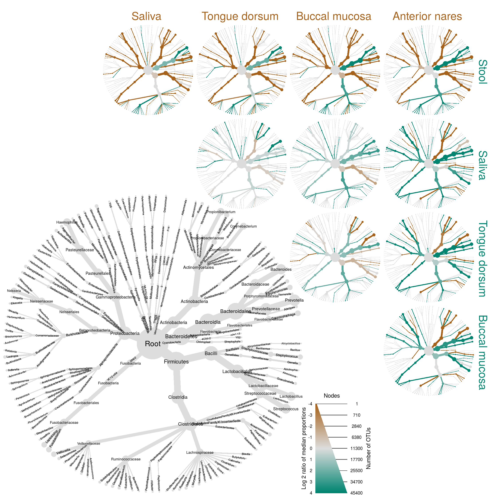

[](https://travis-ci.org/grunwaldlab/metacoder?branch=master) [](https://codecov.io/github/grunwaldlab/metacoder?branch=master)
[](http://www.r-pkg.org/pkg/metacoder)
[](http://www.r-pkg.org/pkg/metacoder)
[](https://cran.r-project.org/package=metacoder)



An R package for metabarcoding research planning and analysis
-------------------------------------------------------------

Metabarcoding is revolutionizing microbial ecology and presenting new challenges:

-   Numerous database formats make taxonomic data difficult to parse, combine, and subset.
-   Stacked bar charts, commonly used to depict community diversity, lack taxonomic context and are limited by the number of discernible colors.
-   Barcode loci and primers are a source of under-explored bias.

Metacoder is an R package that attempts to addresses these issues:

-   Sources of taxonomic data can be extracted from most file formats and manipulated.
-   Community diversity can be visualized by color and size in a tree plot.
-   Primer specificity can be estimated with *in silico* PCR.

## Installation

Stable releases are available on CRAN and can be installed in the standard way:

    install.packages("metacoder")

The most recent version can be installed from Github:

    devtools::install_github("ropensci/taxa")
    devtools::install_github("grunwaldlab/metacoder")
    library(metacoder)


```{r child = 'vignettes/introduction.Rmd'}
```
