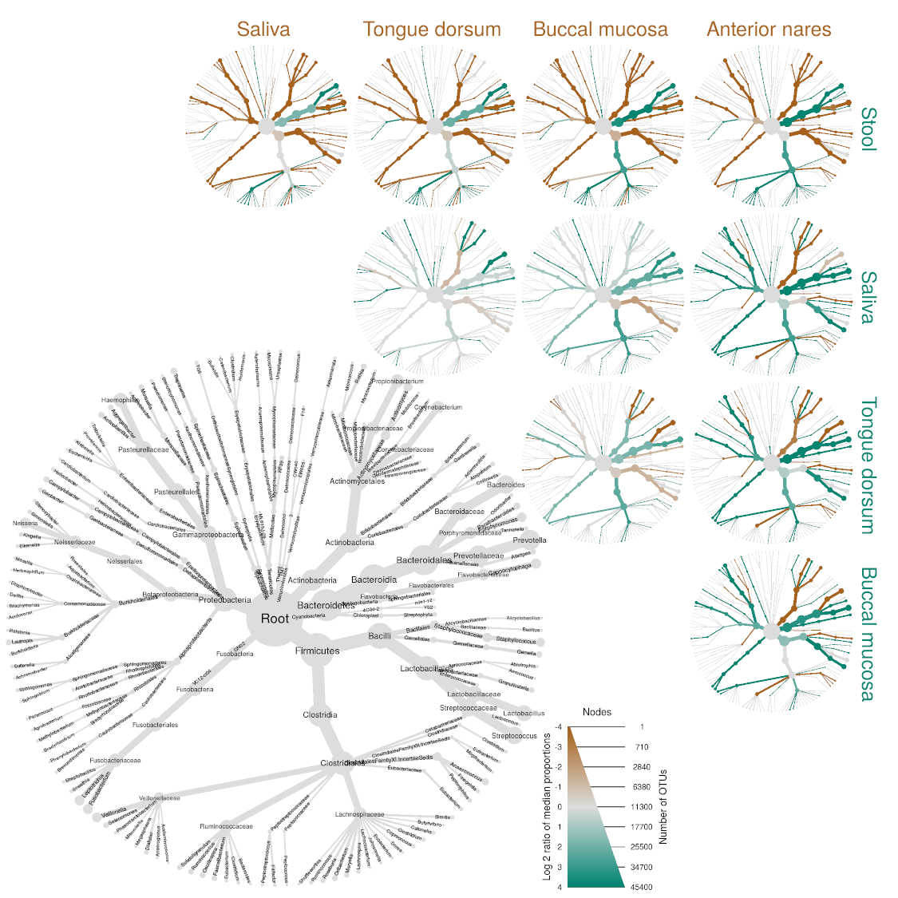

<!-- README.md is generated from README.Rmd. Please edit that file -->

[](https://www.r-pkg.org:443/pkg/metacoder)
[](https://www.r-pkg.org:443/pkg/metacoder)
[](https://cran.r-project.org/package=metacoder)



## An R package for metabarcoding research planning and analysis

Metacoder is an R package for reading, plotting, and manipulating large
taxonomic data sets, like those generated from modern high-throughput
sequencing, like metabarcoding (i.e. amplification metagenomics, 16S
metagenomics, etc). It provides a tree-based visualization called “heat
trees” used to depict statistics for every taxon in a taxonomy using
color and size. It also provides various functions to do common tasks in
microbiome bioinformatics on data in the `taxmap` format defined by the
`taxa` package, such as:

- Summing read counts/abundance per taxon
- Converting counts to proportions and rarefaction of counts using
  `vegan`
- Comparing the abundance (or other characteristics) of groups of
  samples (e.g., experimental treatments) per taxon
- Combining data for groups of samples
- Simulated PCR, via EMBOSS primersearch, for testing primer specificity
  and coverage of taxonomic groups
- Converting common microbiome formats for data and reference databases
  into the objects defined by the `taxa` package.
- Converting to and from the `phyloseq` format and the `taxa` format

## Installation

This project is available on CRAN and can be installed like so:

``` r
install.packages("metacoder")
```

You can also install the development version for the newest features,
bugs, and bug fixes:

``` r
install.packages("devtools")
devtools::install_github("grunwaldlab/metacoder")
```

## Documentation

All the documentation for `metacoder` can be found on our website here:

<https://grunwaldlab.github.io/metacoder_documentation/>

## Dependencies

The function that simulates PCR requires `primersearch` from the EMBOSS
tool kit to be installed. This is not an R package, so it is not
automatically installed. Type `?primersearch` after installing and
loading metacoder for installation instructions.

## Relationship with other packages

Many of these operations can be done using other packages like
`phyloseq`, which also provides tools for diversity analysis. The main
strength of `metacoder` is that its functions use the flexible data
types defined by `taxa`, which has powerful parsing and subsetting
abilities that take into account the hierarchical relationship between
taxa and user-defined data. In general, `metacoder` and `taxa` are more
of an abstracted tool kit, whereas `phyloseq` has more specialized
functions for community diversity data, but they both can do similar
things. I encourage you to try both to see which fits your needs and
style best. You can also combine the two in a single analysis by
converting between the two data types when needed.

## Citation

If you use metcoder in a publication, please cite our [article in PLOS
Computational
Biology](https://journals.plos.org/ploscompbiol/article?id=10.1371/journal.pcbi.1005404):

Foster ZSL, Sharpton TJ, Grünwald NJ (2017) Metacoder: An R package for
visualization and manipulation of community taxonomic diversity data.
PLOS Computational Biology 13(2): e1005404.
<https://doi.org/10.1371/journal.pcbi.1005404>

## Future development

Metacoder is under active development and many new features are planned.
Some improvements that are being explored include:

- Barcoding gap analysis and associated plotting functions
- A function to aid in retrieving appropriate sequence data from NCBI
  for *in silico* PCR from whole genome sequences
- Graphing of different node shapes in heat trees, possibly including
  pie graphs or [PhyloPics](http://phylopic.org/).
- Adding the ability to plot specific edge lengths in the heat trees so
  they can be used for phylogenetic trees.
- Adding more data import and export functions to make parsing and
  writing common formats easier.

To see the details of what is being worked on, check out the
[issues](https://github.com/grunwaldlab/metacoder/issues) tab of the
Metacoder [Github site](https://github.com/grunwaldlab).

## License

This work is subject to the [MIT
License](https://github.com/grunwaldlab/metacoder/blob/master/LICENSE).

## Acknowledgements

Metacoder’s major dependencies are `taxa`, `taxize`, `vegan`, `igraph`,
`dplyr`, and `ggplot2`.

This package includes code from the R package
[ggrepel](https://github.com/slowkow/ggrepel) to handle label overlap
avoidance with permission from the author of
[ggrepel](https://github.com/slowkow/ggrepel) [Kamil
Slowikowski](https://github.com/slowkow). We included the code instead
of depending on `ggrepel` because we are using functions internal to
`ggrepel` that might change in the future. We thank Kamil Slowikowski
for letting us use his code and would like to acknowledge his
implementation of the label overlap avoidance used in metacoder.

## Feedback and contributions

We would like to hear about users’ thoughts on the package and any
errors they run into. Please report errors, questions or suggestions on
the [issues](https://github.com/grunwaldlab/metacoder/issues) tab of the
Metacoder [Github site](https://github.com/grunwaldlab). We also welcome
contributions via a Github [pull
request](https://help.github.com/articles/using-pull-requests/). You can
also talk with us using our [Google
groups](https://groups.google.com/forum/#!forum/metacoder-discussions)
site.
