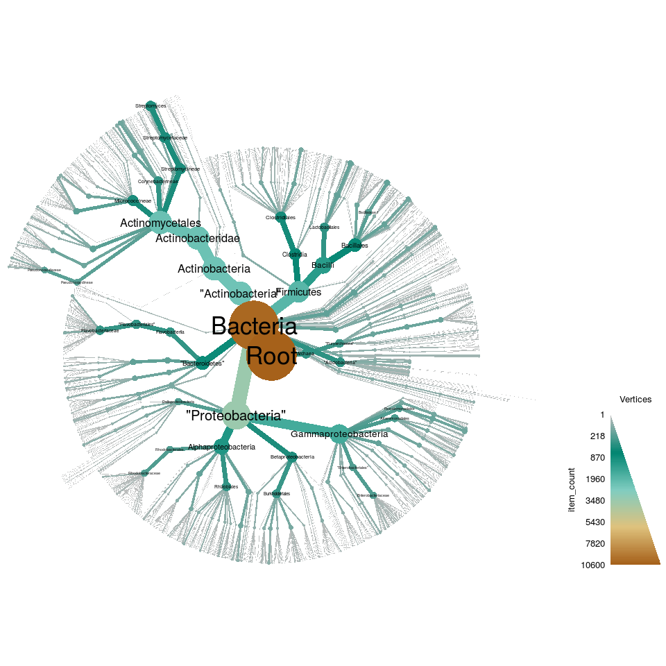
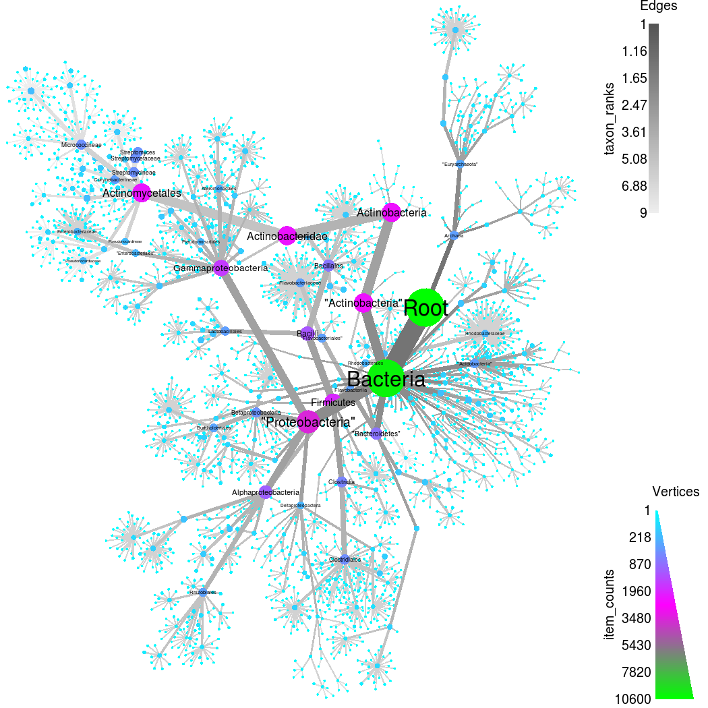
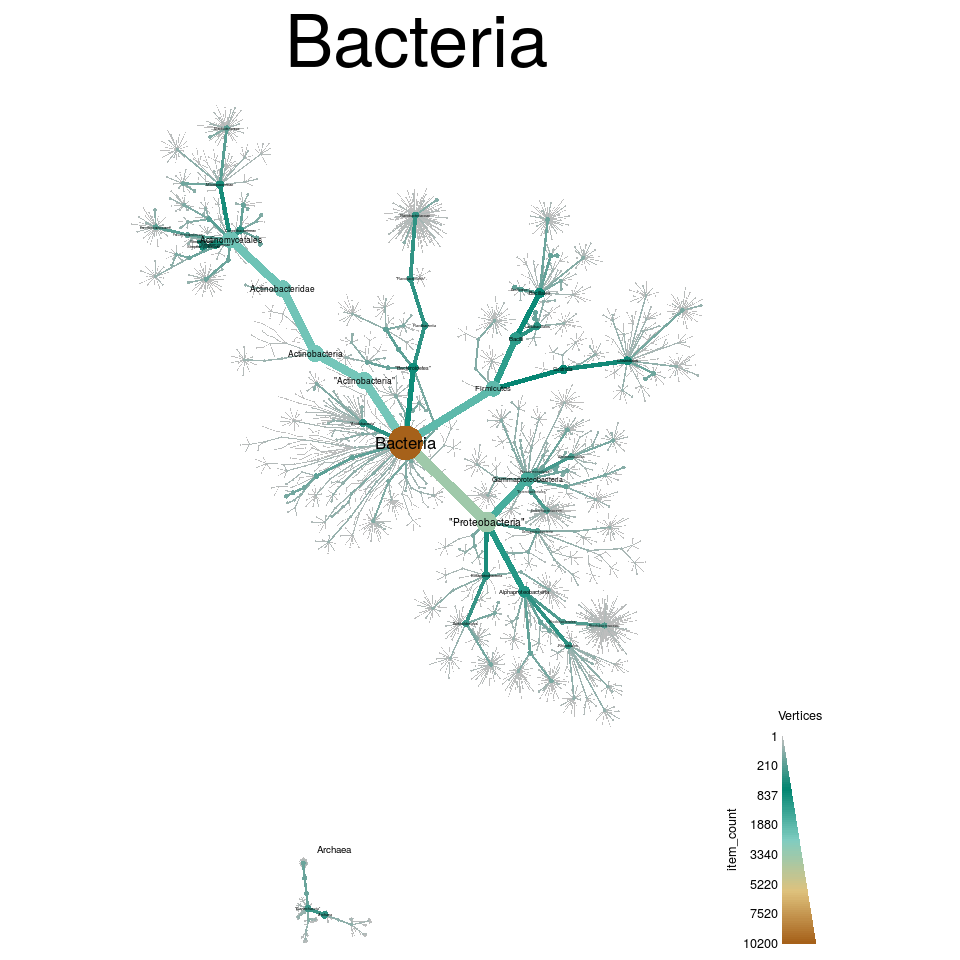
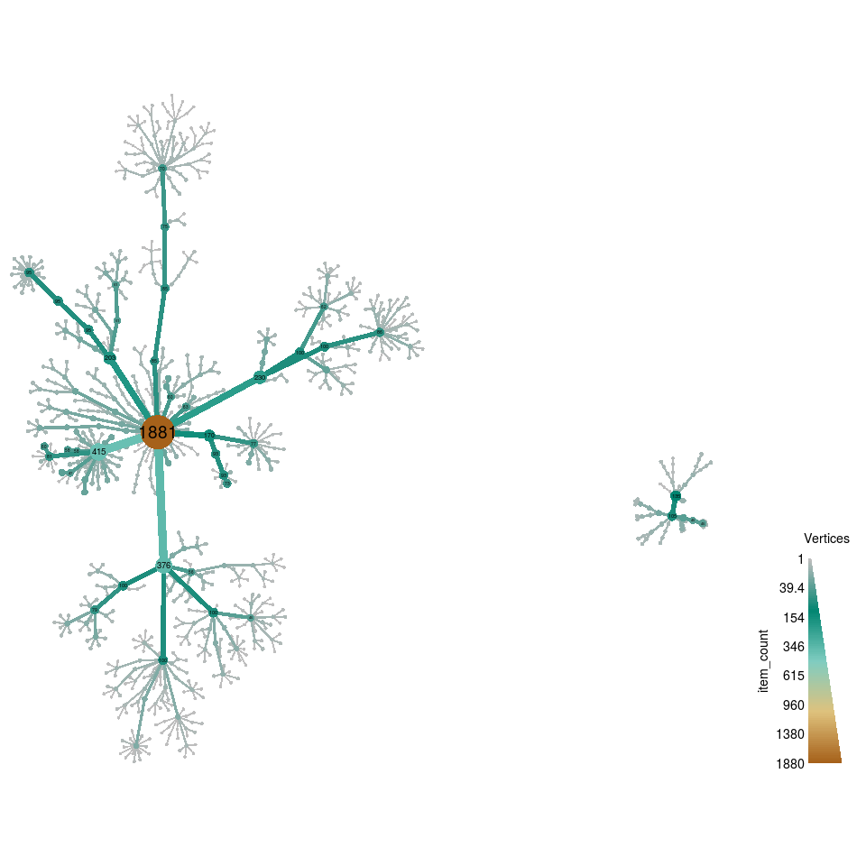
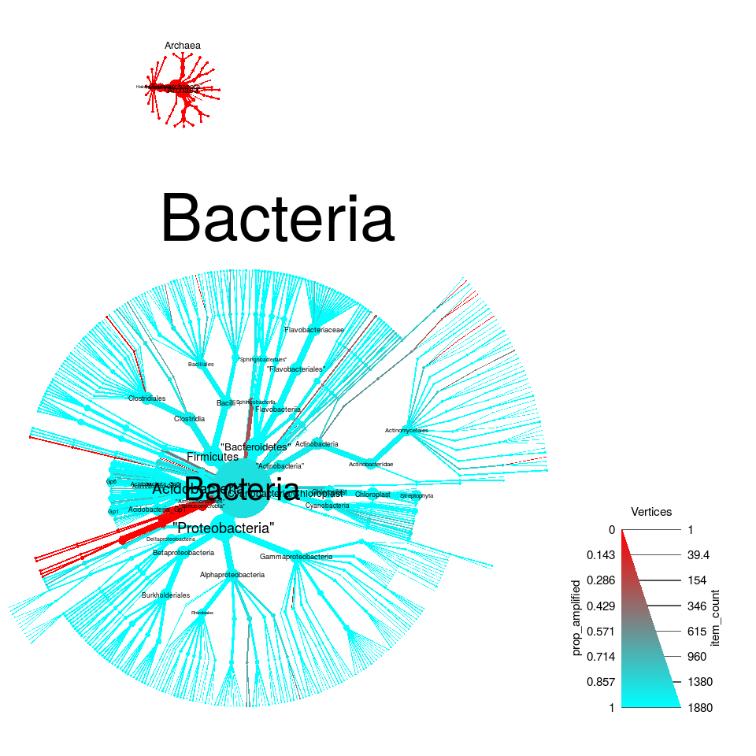
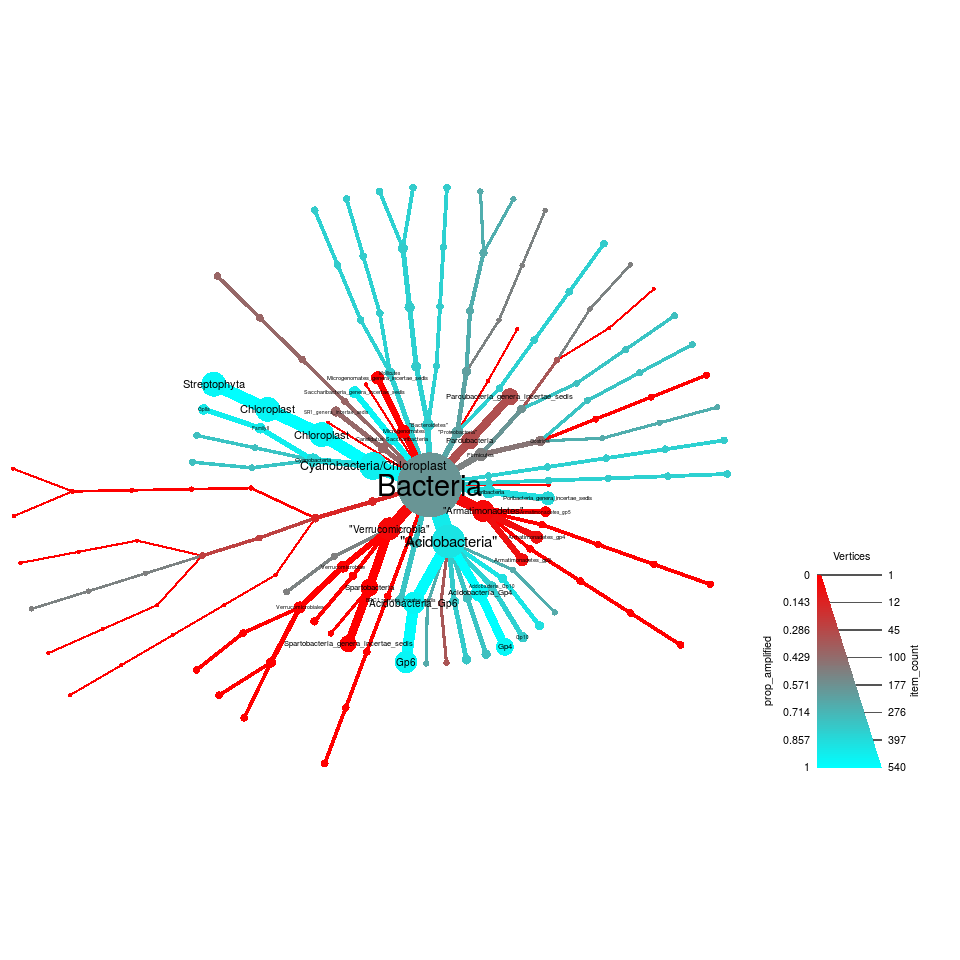
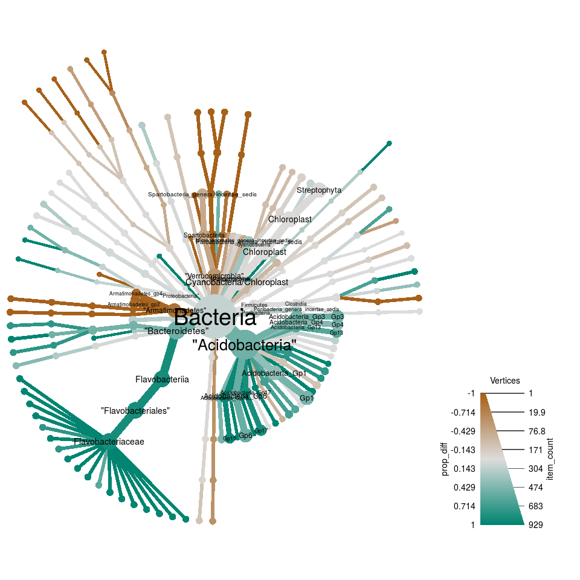

[](https://travis-ci.org/grunwaldlab/metacoder?branch=master)
[](https://codecov.io/github/grunwaldlab/metacoder?branch=master)


## An R package for metabarcoding research planning and analysis

Metabarcoding is revolutionizing microbial ecology and presenting new challenges:

* Numerous database formats make taxonomic data difficult to parse, combine, and subset.
* Stacked bar charts, commonly used to depict community diversity, lack taxonomic context.
* Barcode loci and primers are a source of under-explored bias.

MetacodeR is an R package that attempts to addresses these issues:

* Sources of taxonomic data can be extracted from any file format and manipulated. 
* Community diversity can be visualized by color and size in a tree plot.
* Primer specificity can be estimated with *in silico* PCR.

### Documentation

Documentation is under construction at http://grunwaldlab.github.io/metacoder.

### Download the current version

While this project is in development it can be installed through github:

    devtools::install_github(repo="grunwaldlab/metacoder", build_vignettes = TRUE)
    library(metacoder)

If you've built the vignettes, you can browse them with:

    browseVignettes(package="metacoder")
    
### Dependencies

The function that runs *in silico* PCR requires `primersearch` from the EMBOSS tool kit to be installed. 
This is not an R package, so it is not automatically installed.
Type `?primersearch` after installing and loading MetcodeR for installation instructions.


### Extracting taxonomic data

Most databases have a unique file format and taxonomic hierarchy/nomenclature.
Taxonomic data can be extracted from any file format using the **extract_taxonomy** function.
Classifications can be parsed offline or retrieved from online databases if a taxon name, taxon ID, or sequence ID is present.
A regular expression with capture groups and a corresponding key is used to define how to parse the file.
The example code below parses the 16s Ribosome Database Project training set for Mothur.
R can be used to download files from the internet and decompress them.
The code below downloads the compressed data to a temporary directory:


```r
rdp_fasta_url <- "http://mothur.org/w/images/b/b5/Trainset10_082014.rdp.tgz"
temp_dir_path <- tempdir()
local_file_path <- file.path(temp_dir_path, basename(rdp_fasta_url))
download.file(url = rdp_fasta_url, destfile = local_file_path, quiet = TRUE)
```

Next we will uncompress the archive and identify the fasta file.


```r
# Get contents of tar archive
unpacked_file_paths <- untar(local_file_path, list = TRUE)
# Uncompress archive
untar(local_file_path, exdir = temp_dir_path)
# Identify the Mothur RDP training set
unpacked_fasta_path <- file.path(temp_dir_path, 
                                  unpacked_file_paths[grepl("fasta$", unpacked_file_paths)])
```

The file can then be parsed using the `ape` package and the taxonomy data in the headers can be extracted by `extract_taxonomy`:


```r
# Load the package
library(metacoder)
# Load the input FASTA file
seqs <- ape::read.FASTA(unpacked_fasta_path)
# Print an example of the sequence headers
cat(names(seqs)[1])
```

```
## AB294171_S001198039	Root;Bacteria;Firmicutes;Bacilli;Lactobacillales;Carnobacteriaceae;Alkalibacterium
```

```r
# Extract the taxonomic information of the sequences
data <- extract_taxonomy(seqs, regex = "^(.*)\\t(.*)",
                         key = c(seq_id = "item_info", "class"),
                         class_sep = ";")
```

Note, that this command will take a while to process. 
The resulting object contains sequence information associated with an inferred taxonomic hierarchy.
The information associated with each taxon can be accessed using the **taxon_data** function:


```r
# Print a few rows of the taxon data
taxon_data(data, row_subset = 1:10) 
```

```
##    taxon_ids parent_ids              name item_counts taxon_ranks
## 1          1       <NA>              Root       10650           1
## 2          2          1           Archaea         410           2
## 3          3          1          Bacteria       10240           2
## 4          4          2   "Crenarchaeota"          55           3
## 5          5          2   "Euryarchaeota"         335           3
## 6          6          2    "Korarchaeota"          10           3
## 7          7          2   "Nanoarchaeota"           3           3
## 8          8          2 Nanohaloarchaeota           1           3
## 9          9          2  "Thaumarchaeota"           6           3
## 10        10          4      Thermoprotei          55           4
```

Columns such as "item_counts" and "taxon_ranks" are calculated each time the function is by default, ensuring that are consistent with any changes made to the taxonomy. 

### Metadiversity Plots

The hierarchical nature of taxonomic data makes it difficult to plot effectively.
Most often, bar charts, stacked bar charts, or pie graphs are used, but these are ineffective when plotting many taxa or multiple ranks.
MetacodeR maps taxonomic data (e.g. sequence abundance) to color/size of tree components in what we call a **Metadiversity Plot**:


```r
plot(data, vertex_size = item_counts, vertex_label = name, vertex_color = item_counts)
```




Note, that this command can take a few minutes. 
The default size range displayed is optimized for each plot.
The legend represents the number of sequences for each taxon as both a color gradient and width of vertices.
Only a few options are needed to make effective plots, yet many are available for customization of publication-ready graphics:


```r
plot(data, vertex_size = item_counts, edge_color = taxon_ranks,
     vertex_label = name, vertex_color = item_counts,
     vertex_color_range = c("cyan", "magenta", "green"),
     edge_color_range   = c("#555555", "#EEEEEE"),
     layout = "davidson-harel", overlap_avoidance = 0.5)
```



The above command can take several minutes.


Note that `plot` is a generic R function that works differently depending on what it is given to it
MetacodeR supplies the function **plot_taxonomy**, which is used when plot is given the type of data outputted by `extract_taxonomy`.
To see the long list of available plotting options, type `?plot_taxonomy`.

### Subsetting

Taxonomic data can be easily subset using the **subset** function.
The user can choose preserve or remove the subtaxa, supertaxa, and sequence data of the subset.
For example, `subset` can be used to look at just the Archaea:


```r
plot(subset(data, name == "Archaea"), vertex_size = item_counts, 
     vertex_label = name, vertex_color = item_counts, layout = "fruchterman-reingold")
```


Any column displayed by `taxon_data` can be used with `subset` as if it were a variable on its own.
To make the Archaea-Bacteria division more clear, the "Root" taxon can be removed, resulting in two separate trees:


```r
subsetted <- subset(data, taxon_ranks > 1)
plot(subsetted, vertex_size = item_counts, vertex_label = name,
     vertex_color = item_counts, tree_label = name, layout = "davidson-harel")
```




### Taxonomically balanced sampling

When calculating statistics for taxa, the amount of data should be balanced across taxa and there should be enough data per taxon to provide unbiased estimates.
Random samples from large reference databases are biased towards overrepresented taxa.
The function **taxonomic_sample** is used to create taxonomically balanced random samples.
The acceptable range of sequence or subtaxa counts can be defined for each taxonomic rank; taxa with too few are excluded and taxa with too many are randomly subsampled.
The code below samples the data such that rank 6 taxa will have 5 sequences and rank 3 taxa (phyla) will have less than 100:


```r
sampled <- taxonomic_sample(subsetted, max_counts = c("3" = 100, "6" = 5), min_counts = c("6" = 5))
sampled <- subset(sampled, item_counts > 0, itemless = FALSE) 
```


```r
plot(sampled, vertex_size = item_counts, vertex_label = item_counts, overlap_avoidance = 0.5,
     vertex_color = item_counts, layout = "davidson-harel")
```




### In silico PCR

The function **primersearch** is a wrapper for an EMBOSS tool that implements *in silico* PCR.
The code below estimates the coverage of the universal bacterial primer pair 357F/519F: 


```r
pcr <- primersearch(sampled, forward = "CTCCTACGGGAGGCAGCAG", reverse = "GWATTACCGCGGCKGCTG",
                    pair_name = "357F_519R",  mismatch = 10)
taxon_data(pcr, row_subset = 1:10)
```

```
##    taxon_ids parent_ids              name item_counts taxon_ranks count_amplified prop_amplified
## 2          2       <NA>           Archaea         135           1               0      0.0000000
## 3          3       <NA>          Bacteria        1881           1            1656      0.8803828
## 4          4          2   "Crenarchaeota"          10           2               0      0.0000000
## 5          5          2   "Euryarchaeota"         105           2               0      0.0000000
## 6          6          2    "Korarchaeota"          10           2               0      0.0000000
## 7          7          2   "Nanoarchaeota"           3           2               0      0.0000000
## 8          8          2 Nanohaloarchaeota           1           2               0      0.0000000
## 9          9          2  "Thaumarchaeota"           6           2               0      0.0000000
## 10        10          4      Thermoprotei          10           3               0      0.0000000
## 14        14         10      Sulfolobales           5           4               0      0.0000000
```

The proportion of sequences amplified can be represented by color in a metadiversity plot:


```r
plot(pcr, vertex_size = item_counts, vertex_label = name, vertex_color = prop_amplified,
     vertex_color_range =  c("red", "cyan"), vertex_color_trans = "radius", tree_label = name)
```




This plot makes it apparent that no Archaea were amplified and most Bacteria were amplified, but not all.
The data can also be subset to better see what did not get amplified:


```r
library(magrittr) # Adds optional %>% operator for chaining commands
pcr %>%
  subset(name == "Bacteria") %>%
  subset(count_amplified < item_counts, subtaxa = FALSE) %>% 
  plot(vertex_size = item_counts, vertex_label = name, vertex_color = prop_amplified,
       vertex_color_range =  c("red", "cyan"),
       vertex_color_interval = c(0, 1), vertex_color_trans = "radius")
```




### Differential Metadiversity Plots

We can use what we call **Differential Metadiversity Plots** to compare the values of treatments such as:

* the relative abundance of taxa in two communities
* the coverages of different primer pairs

Here, we compare the effectiveness of two primer pairs, 357F/519F and 515F/1100R, by plotting the difference in proportions amplified by each.
First, the same sequences are amplified with 515F/1100R and results for the two primer pairs combined:


```r
pcr_2 <- primersearch(sampled, forward = "GTGCCAGCMGCCGCGGTAA", reverse = "AGGGTTGCGCTCGTTG",
                      pair_name = "515F_1100R", mismatch = 10)
pcr$taxon_data$count_amplified_2 <- taxon_data(pcr_2, "count_amplified")
pcr$taxon_data$prop_diff <- taxon_data(pcr, "prop_amplified") - taxon_data(pcr_2, "prop_amplified")
```

Then, taxa that are not amplified by both pairs can be subset and the difference in amplification plotted.
In the plot below, green corresponds to taxa amplified by 357F/519F but not 515F/1100R and brown is the opposite:


```r
pcr %>%
  subset(name == "Bacteria") %>%
  subset(count_amplified < item_counts | count_amplified_2 < item_counts, subtaxa = FALSE) %>%
  plot(vertex_size = item_counts, vertex_label = name,
       vertex_color = prop_diff, vertex_color_range = diverging_palette(),
       vertex_color_interval = c(-1, 1), vertex_color_trans = "radius")
```




### Plans for future development

MetacodeR is under active development and many new features are planned.
Some improvements that are being worked on include:

* Increases in function speed
* Plotting functions for pairwise comparison of treatments
* Barcoding gap analysis and associated plotting functions
* A function to aid in retrieving appropriate sequence data from NCBI for *in silico* PCR from whole genome sequences.

To see the details of what is being worked on, check out the [issues](https://github.com/grunwaldlab/metacoder/issues) tab of the MetacodeR [Github site](https://github.com/grunwaldlab).

### Error reports, comments, and contributions

We would like to hear about users' thoughts on the package and any errors they run into.
Please report bugs and comments on the [issues](https://github.com/grunwaldlab/metacoder/issues) tab of the MetacodeR [Github site](https://github.com/grunwaldlab).
We also welcome contributions via a Github [pull request](https://help.github.com/articles/using-pull-requests/).

### Aknowledgements

We thank Tom Sharpton for sharing his metagenomics expertise and advising us.
MetacodeR's major dependencies are taxize, igraph, and ggplot2.
