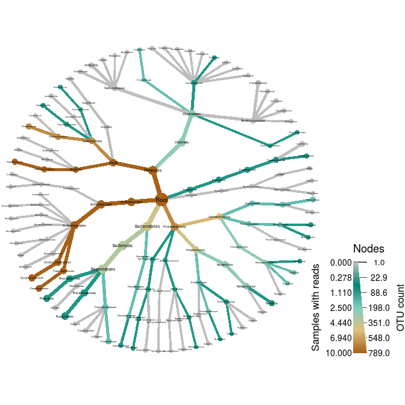
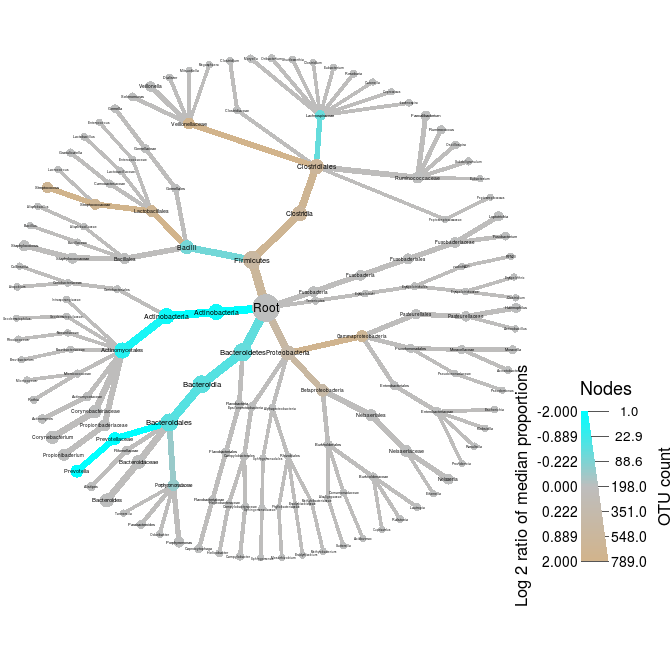

<!-- README.md is generated from README.Rmd. Please edit that file -->
[](https://travis-ci.org/grunwaldlab/metacoder?branch=master) [](https://codecov.io/github/grunwaldlab/metacoder?branch=master) [](http://www.r-pkg.org/pkg/metacoder) [](http://www.r-pkg.org/pkg/metacoder) [](https://cran.r-project.org/package=metacoder)


An R package for metabarcoding research planning and analysis
-------------------------------------------------------------

Metabarcoding is revolutionizing microbial ecology and presenting new challenges:

-   Numerous database formats make taxonomic data difficult to parse, combine, and subset.
-   Stacked bar charts, commonly used to depict community diversity, lack taxonomic context and are limited by the number of discernible colors.
-   Barcode loci and primers are a source of under-explored bias.

Metacoder is an R package that attempts to addresses these issues:

-   Sources of taxonomic data can be extracted from most file formats and manipulated.
-   Community diversity can be visualized by color and size in a tree plot.
-   Primer specificity can be estimated with *in silico* PCR.

Installation
------------

Stable releases are available on CRAN and can be installed in the standard way:

    install.packages("metacoder")

The most recent version can be installed from Github:

    devtools::install_github("ropensci/taxa")
    devtools::install_github("grunwaldlab/metacoder")
    library(metacoder)

Documentation
-------------

This is only a short demonstration. See the full documentation at <http://grunwaldlab.github.io/metacoder_documentation>.

Parsing
-------

Many functions that used to be in `metacoder` have now been moved into the `taxa` package. These include the flexible parsers and dplyr-like data-manipulation functions. If you have an non-standard data format or want to use the more flexible `taxa` parsers, check out the intro to the taxa package [here](https://github.com/ropensci/taxa). `Metacoder` now has functions for parsing specific file formats used in metagenomics research. However, for this demonstration, we will be using a parser from the `taxa` package meant for tabular data.

Included in `metacoder` is an example dataset that is a subset of the Human Microbiome Project data. This dataset has two parts:

-   An abundance matrix called `hmp_otus`, with samples in columns and OTUs in rows
-   A sample information table called `hmp_samples`, with samples as rows and columns of information describing the samples (e.g. gender).

This is the preferred way to encode this type of abundance information in `metacoder` and `taxa`. Lets take a look at this data:

``` r
library(metacoder)
#> Loading required package: taxa
#> This is metacoder verison 0.2.1 (stable). If you use metacoder for published research, please cite our paper:
#> 
#> Foster Z, Sharpton T and Grunwald N (2017). "Metacoder: An R package for visualization and manipulation of community taxonomic diversity data." PLOS Computational Biology, 13(2), pp. 1-15. doi: 10.1371/journal.pcbi.1005404
#> 
#> Enter `citation("metacoder")` for a BibTeX entry for this citation.
print(hmp_otus)
#> # A tibble: 1,000 x 52
#>    otu_id lineage `700035949` `700097855` `700100489` `700111314` `700033744` `700109581`
#>    <chr>  <chr>         <int>       <int>       <int>       <int>       <int>       <int>
#>  1 OTU_9… r__Roo…           0           2           1           0           0           0
#>  2 OTU_9… r__Roo…           0           0           0           0           0           0
#>  3 OTU_9… r__Roo…           0           1           0           0           0           0
#>  4 OTU_9… r__Roo…           8          36          10           5          66          38
#>  5 OTU_9… r__Roo…           3          25           0           0           0           1
#>  6 OTU_9… r__Roo…          42         277          16          22          85         211
#>  7 OTU_9… r__Roo…           4          17          21           1          74          12
#>  8 OTU_9… r__Roo…           0           0           0           0           0           0
#>  9 OTU_9… r__Roo…           0           0           0           0           0           0
#> 10 OTU_9… r__Roo…           0           0           0           0           1           0
#> # ... with 990 more rows, and 44 more variables: `700111044` <int>, `700101365` <int>,
#> #   `700100431` <int>, `700016050` <int>, `700032425` <int>, `700024855` <int>,
#> #   `700103488` <int>, `700096869` <int>, `700107379` <int>, `700096422` <int>,
#> #   `700102417` <int>, `700114168` <int>, `700037540` <int>, `700106397` <int>,
#> #   `700113498` <int>, `700033743` <int>, `700105205` <int>, `700024238` <int>,
#> #   `700034183` <int>, `700038390` <int>, `700015973` <int>, `700038124` <int>,
#> #   `700107206` <int>, `700037403` <int>, `700098429` <int>, `700101224` <int>,
#> #   `700114615` <int>, `700024234` <int>, `700108596` <int>, `700101076` <int>,
#> #   `700105882` <int>, `700016902` <int>, `700102242` <int>, `700038231` <int>,
#> #   `700109394` <int>, `700102530` <int>, `700108229` <int>, `700099013` <int>,
#> #   `700098680` <int>, `700106938` <int>, `700014916` <int>, `700095535` <int>,
#> #   `700102367` <int>, `700101358` <int>
print(hmp_samples)
#> # A tibble: 50 x 3
#> # Groups:   body_site, sex [10]
#>    sample_id sex    body_site
#>    <chr>     <chr>  <chr>    
#>  1 700035949 female Nose     
#>  2 700097855 female Nose     
#>  3 700100489 female Nose     
#>  4 700111314 female Nose     
#>  5 700033744 female Nose     
#>  6 700109581 male   Nose     
#>  7 700111044 male   Nose     
#>  8 700101365 male   Nose     
#>  9 700100431 male   Nose     
#> 10 700016050 male   Nose     
#> # ... with 40 more rows
```

We can parse the taxonomic information in the abundance matrix using a parser from `taxa`:

``` r
obj <- parse_tax_data(hmp_otus, class_cols = "lineage", class_sep = ";",
                      class_key = c(tax_rank = "info", tax_name = "taxon_name"),
                      class_regex = "^(.+)__(.+)$")
```

This returns a `taxmap` object. The `taxmap` class is designed to store any number of tables, lists, or vectors associated with taxonomic information and facilitate manipulating the data in a cohesive way. Here is what that object looks like:

``` r
print(obj)
#> <Taxmap>
#>   174 taxa: ab. Root, ac. Proteobacteria ... gr. Blautia, gs. Clostridium
#>   174 edges: NA->ab, ab->ac, ab->ad, ab->ae ... cm->gq, cf->gr, cw->gs
#>   2 data sets:
#>     tax_data:
#>       # A tibble: 1,000 x 53
#>         taxon_id otu_id lineage `700035949` `700097855` `700100489` `700111314`
#>         <chr>    <chr>  <chr>         <int>       <int>       <int>       <int>
#>       1 dm       OTU_9… r__Roo…           0           2           1           0
#>       2 dn       OTU_9… r__Roo…           0           0           0           0
#>       3 do       OTU_9… r__Roo…           0           1           0           0
#>       # ... with 997 more rows, and 46 more variables: `700033744` <int>,
#>       #   `700109581` <int>, `700111044` <int>, `700101365` <int>,
#>       #   `700100431` <int>, `700016050` <int>, `700032425` <int>,
#>       #   `700024855` <int>, `700103488` <int>, `700096869` <int>,
#>       #   `700107379` <int>, `700096422` <int>, `700102417` <int>,
#>       #   `700114168` <int>, `700037540` <int>, `700106397` <int>,
#>       #   `700113498` <int>, `700033743` <int>, `700105205` <int>,
#>       #   `700024238` <int>, `700034183` <int>, `700038390` <int>,
#>       #   `700015973` <int>, `700038124` <int>, `700107206` <int>,
#>       #   `700037403` <int>, `700098429` <int>, `700101224` <int>,
#>       #   `700114615` <int>, `700024234` <int>, `700108596` <int>,
#>       #   `700101076` <int>, `700105882` <int>, `700016902` <int>,
#>       #   `700102242` <int>, `700038231` <int>, `700109394` <int>,
#>       #   `700102530` <int>, `700108229` <int>, `700099013` <int>,
#>       #   `700098680` <int>, `700106938` <int>, `700014916` <int>,
#>       #   `700095535` <int>, `700102367` <int>, `700101358` <int>
#>     class_data:
#>       # A tibble: 5,922 x 5
#>         taxon_id input_index tax_rank tax_name            regex_match          
#>         <chr>          <int> <chr>    <chr>               <chr>                
#>       1 ab                 1 r        Root                r__Root              
#>       2 ac                 1 p        Proteobacteria      p__Proteobacteria    
#>       3 aj                 1 c        Gammaproteobacteria c__Gammaproteobacter…
#>       # ... with 5,919 more rows
#>   0 functions:
```

Abundance matrix manipulations
------------------------------

### Removing low-abundance counts

Low-abundance sequences might be the result of sequencing error, so typically we remove any counts/OTUs with less than some number of reads. Lets set all counts with less than 5 reads to zero:

``` r
obj$data$tax_data <- zero_low_counts(obj, "tax_data", min_count = 5)
#> No `cols` specified, so using all numeric columns:
#>    700035949, 700097855, 700100489 ... 700095535, 700102367, 700101358
#> Zeroing 4325 of 50000 counts less than 5.
```

There might now be some OTUs with no "real" reads. Lets check:

``` r
no_reads <- rowSums(obj$data$tax_data[, hmp_samples$sample_id]) == 0
sum(no_reads)
#> [1] 211
```

It appears that 211 of 1000 OTUs now have no reads. We can remove those OTUs and their associated taxa with `filter_obs`:

``` r
obj <- filter_obs(obj, "tax_data", ! no_reads, drop_taxa = TRUE)
print(obj)
#> <Taxmap>
#>   155 taxa: ab. Root, ac. Proteobacteria ... gs. Clostridium
#>   155 edges: NA->ab, ab->ac, ab->ad, ab->ae ... dk->gp, cm->gq, cw->gs
#>   2 data sets:
#>     tax_data:
#>       # A tibble: 789 x 51
#>         taxon_id `700035949` `700097855` `700100489` `700111314` `700033744`
#>         <chr>          <dbl>       <dbl>       <dbl>       <dbl>       <dbl>
#>       1 dm                0.          0.          0.          0.          0.
#>       2 dn                0.          0.          0.          0.          0.
#>       3 do                0.          0.          0.          0.          0.
#>       # ... with 786 more rows, and 45 more variables: `700109581` <dbl>,
#>       #   `700111044` <dbl>, `700101365` <dbl>, `700100431` <dbl>,
#>       #   `700016050` <dbl>, `700032425` <dbl>, `700024855` <dbl>,
#>       #   `700103488` <dbl>, `700096869` <dbl>, `700107379` <dbl>,
#>       #   `700096422` <dbl>, `700102417` <dbl>, `700114168` <dbl>,
#>       #   `700037540` <dbl>, `700106397` <dbl>, `700113498` <dbl>,
#>       #   `700033743` <dbl>, `700105205` <dbl>, `700024238` <dbl>,
#>       #   `700034183` <dbl>, `700038390` <dbl>, `700015973` <dbl>,
#>       #   `700038124` <dbl>, `700107206` <dbl>, `700037403` <dbl>,
#>       #   `700098429` <dbl>, `700101224` <dbl>, `700114615` <dbl>,
#>       #   `700024234` <dbl>, `700108596` <dbl>, `700101076` <dbl>,
#>       #   `700105882` <dbl>, `700016902` <dbl>, `700102242` <dbl>,
#>       #   `700038231` <dbl>, `700109394` <dbl>, `700102530` <dbl>,
#>       #   `700108229` <dbl>, `700099013` <dbl>, `700098680` <dbl>,
#>       #   `700106938` <dbl>, `700014916` <dbl>, `700095535` <dbl>,
#>       #   `700102367` <dbl>, `700101358` <dbl>
#>     class_data:
#>       # A tibble: 5,903 x 5
#>         taxon_id input_index tax_rank tax_name            regex_match          
#>         <chr>          <int> <chr>    <chr>               <chr>                
#>       1 ab                 1 r        Root                r__Root              
#>       2 ac                 1 p        Proteobacteria      p__Proteobacteria    
#>       3 aj                 1 c        Gammaproteobacteria c__Gammaproteobacter…
#>       # ... with 5,900 more rows
#>   0 functions:
```

Note how there are fewer taxa now, as well as fewer OTUs. This coordinated manipulation of taxonomic and abundance data is one of the main benefits of using the `taxmap` class.

### Accounting for un-even sampling

These are raw counts, but people typically work with rarefied counts or proportions to avoid sampling depth biasing the results. The function `rarefy_obs` will return the rarefied counts for a table in a taxmap object, but lets use proportions for this demonstration:

``` r
obj$data$tax_data <- calc_obs_props(obj, "tax_data")
#> No `cols` specified, so using all numeric columns:
#>    700035949, 700097855, 700100489 ... 700095535, 700102367, 700101358
#> Calculating proportions from counts for 50 columns for 789 observations.
print(obj)
#> <Taxmap>
#>   155 taxa: ab. Root, ac. Proteobacteria ... gs. Clostridium
#>   155 edges: NA->ab, ab->ac, ab->ad, ab->ae ... dk->gp, cm->gq, cw->gs
#>   2 data sets:
#>     tax_data:
#>       # A tibble: 789 x 51
#>         taxon_id `700035949` `700097855` `700100489` `700111314` `700033744`
#>         <chr>          <dbl>       <dbl>       <dbl>       <dbl>       <dbl>
#>       1 dm                0.          0.          0.          0.          0.
#>       2 dn                0.          0.          0.          0.          0.
#>       3 do                0.          0.          0.          0.          0.
#>       # ... with 786 more rows, and 45 more variables: `700109581` <dbl>,
#>       #   `700111044` <dbl>, `700101365` <dbl>, `700100431` <dbl>,
#>       #   `700016050` <dbl>, `700032425` <dbl>, `700024855` <dbl>,
#>       #   `700103488` <dbl>, `700096869` <dbl>, `700107379` <dbl>,
#>       #   `700096422` <dbl>, `700102417` <dbl>, `700114168` <dbl>,
#>       #   `700037540` <dbl>, `700106397` <dbl>, `700113498` <dbl>,
#>       #   `700033743` <dbl>, `700105205` <dbl>, `700024238` <dbl>,
#>       #   `700034183` <dbl>, `700038390` <dbl>, `700015973` <dbl>,
#>       #   `700038124` <dbl>, `700107206` <dbl>, `700037403` <dbl>,
#>       #   `700098429` <dbl>, `700101224` <dbl>, `700114615` <dbl>,
#>       #   `700024234` <dbl>, `700108596` <dbl>, `700101076` <dbl>,
#>       #   `700105882` <dbl>, `700016902` <dbl>, `700102242` <dbl>,
#>       #   `700038231` <dbl>, `700109394` <dbl>, `700102530` <dbl>,
#>       #   `700108229` <dbl>, `700099013` <dbl>, `700098680` <dbl>,
#>       #   `700106938` <dbl>, `700014916` <dbl>, `700095535` <dbl>,
#>       #   `700102367` <dbl>, `700101358` <dbl>
#>     class_data:
#>       # A tibble: 5,903 x 5
#>         taxon_id input_index tax_rank tax_name            regex_match          
#>         <chr>          <int> <chr>    <chr>               <chr>                
#>       1 ab                 1 r        Root                r__Root              
#>       2 ac                 1 p        Proteobacteria      p__Proteobacteria    
#>       3 aj                 1 c        Gammaproteobacteria c__Gammaproteobacter…
#>       # ... with 5,900 more rows
#>   0 functions:
```

### Getting per-taxon information

Currently, we have values for the abundance of each OTU, not each taxon. To get information on the taxa, we can sum the abundance per-taxon like so:

``` r
obj$data$tax_abund <- calc_taxon_abund(obj, "tax_data",
                                       cols = hmp_samples$sample_id)
#> Summing per-taxon counts from 50 columns for 155 taxa
print(obj)
#> <Taxmap>
#>   155 taxa: ab. Root, ac. Proteobacteria ... gs. Clostridium
#>   155 edges: NA->ab, ab->ac, ab->ad, ab->ae ... dk->gp, cm->gq, cw->gs
#>   3 data sets:
#>     tax_data:
#>       # A tibble: 789 x 51
#>         taxon_id `700035949` `700097855` `700100489` `700111314` `700033744`
#>         <chr>          <dbl>       <dbl>       <dbl>       <dbl>       <dbl>
#>       1 dm                0.          0.          0.          0.          0.
#>       2 dn                0.          0.          0.          0.          0.
#>       3 do                0.          0.          0.          0.          0.
#>       # ... with 786 more rows, and 45 more variables: `700109581` <dbl>,
#>       #   `700111044` <dbl>, `700101365` <dbl>, `700100431` <dbl>,
#>       #   `700016050` <dbl>, `700032425` <dbl>, `700024855` <dbl>,
#>       #   `700103488` <dbl>, `700096869` <dbl>, `700107379` <dbl>,
#>       #   `700096422` <dbl>, `700102417` <dbl>, `700114168` <dbl>,
#>       #   `700037540` <dbl>, `700106397` <dbl>, `700113498` <dbl>,
#>       #   `700033743` <dbl>, `700105205` <dbl>, `700024238` <dbl>,
#>       #   `700034183` <dbl>, `700038390` <dbl>, `700015973` <dbl>,
#>       #   `700038124` <dbl>, `700107206` <dbl>, `700037403` <dbl>,
#>       #   `700098429` <dbl>, `700101224` <dbl>, `700114615` <dbl>,
#>       #   `700024234` <dbl>, `700108596` <dbl>, `700101076` <dbl>,
#>       #   `700105882` <dbl>, `700016902` <dbl>, `700102242` <dbl>,
#>       #   `700038231` <dbl>, `700109394` <dbl>, `700102530` <dbl>,
#>       #   `700108229` <dbl>, `700099013` <dbl>, `700098680` <dbl>,
#>       #   `700106938` <dbl>, `700014916` <dbl>, `700095535` <dbl>,
#>       #   `700102367` <dbl>, `700101358` <dbl>
#>     class_data:
#>       # A tibble: 5,903 x 5
#>         taxon_id input_index tax_rank tax_name            regex_match          
#>         <chr>          <int> <chr>    <chr>               <chr>                
#>       1 ab                 1 r        Root                r__Root              
#>       2 ac                 1 p        Proteobacteria      p__Proteobacteria    
#>       3 aj                 1 c        Gammaproteobacteria c__Gammaproteobacter…
#>       # ... with 5,900 more rows
#>     tax_abund:
#>       # A tibble: 155 x 51
#>         taxon_id `700035949` `700097855` `700100489` `700111314` `700033744`
#>       * <chr>          <dbl>       <dbl>       <dbl>       <dbl>       <dbl>
#>       1 ab             1.00      1.00             1.      1.00         1.00 
#>       2 ac             0.206     0.0262           0.      0.252        0.225
#>       3 ad             0.        0.00269          0.      0.0417       0.   
#>       # ... with 152 more rows, and 45 more variables: `700109581` <dbl>,
#>       #   `700111044` <dbl>, `700101365` <dbl>, `700100431` <dbl>,
#>       #   `700016050` <dbl>, `700032425` <dbl>, `700024855` <dbl>,
#>       #   `700103488` <dbl>, `700096869` <dbl>, `700107379` <dbl>,
#>       #   `700096422` <dbl>, `700102417` <dbl>, `700114168` <dbl>,
#>       #   `700037540` <dbl>, `700106397` <dbl>, `700113498` <dbl>,
#>       #   `700033743` <dbl>, `700105205` <dbl>, `700024238` <dbl>,
#>       #   `700034183` <dbl>, `700038390` <dbl>, `700015973` <dbl>,
#>       #   `700038124` <dbl>, `700107206` <dbl>, `700037403` <dbl>,
#>       #   `700098429` <dbl>, `700101224` <dbl>, `700114615` <dbl>,
#>       #   `700024234` <dbl>, `700108596` <dbl>, `700101076` <dbl>,
#>       #   `700105882` <dbl>, `700016902` <dbl>, `700102242` <dbl>,
#>       #   `700038231` <dbl>, `700109394` <dbl>, `700102530` <dbl>,
#>       #   `700108229` <dbl>, `700099013` <dbl>, `700098680` <dbl>,
#>       #   `700106938` <dbl>, `700014916` <dbl>, `700095535` <dbl>,
#>       #   `700102367` <dbl>, `700101358` <dbl>
#>   0 functions:
```

Note that there is now an additional table with one row per taxon.

We can also easily calculate the number of samples have reads for each taxon:

``` r
obj$data$tax_occ <- calc_n_samples(obj, "tax_abund", groups = hmp_samples$body_site)
#> No `cols` specified, so using all numeric columns:
#>    700035949, 700097855, 700100489 ... 700095535, 700102367, 700101358
#> Calculating number of samples with non-zero counts from 50 columns in 5 groups for 155 observations
print(obj)
#> <Taxmap>
#>   155 taxa: ab. Root, ac. Proteobacteria ... gs. Clostridium
#>   155 edges: NA->ab, ab->ac, ab->ad, ab->ae ... dk->gp, cm->gq, cw->gs
#>   4 data sets:
#>     tax_data:
#>       # A tibble: 789 x 51
#>         taxon_id `700035949` `700097855` `700100489` `700111314` `700033744`
#>         <chr>          <dbl>       <dbl>       <dbl>       <dbl>       <dbl>
#>       1 dm                0.          0.          0.          0.          0.
#>       2 dn                0.          0.          0.          0.          0.
#>       3 do                0.          0.          0.          0.          0.
#>       # ... with 786 more rows, and 45 more variables: `700109581` <dbl>,
#>       #   `700111044` <dbl>, `700101365` <dbl>, `700100431` <dbl>,
#>       #   `700016050` <dbl>, `700032425` <dbl>, `700024855` <dbl>,
#>       #   `700103488` <dbl>, `700096869` <dbl>, `700107379` <dbl>,
#>       #   `700096422` <dbl>, `700102417` <dbl>, `700114168` <dbl>,
#>       #   `700037540` <dbl>, `700106397` <dbl>, `700113498` <dbl>,
#>       #   `700033743` <dbl>, `700105205` <dbl>, `700024238` <dbl>,
#>       #   `700034183` <dbl>, `700038390` <dbl>, `700015973` <dbl>,
#>       #   `700038124` <dbl>, `700107206` <dbl>, `700037403` <dbl>,
#>       #   `700098429` <dbl>, `700101224` <dbl>, `700114615` <dbl>,
#>       #   `700024234` <dbl>, `700108596` <dbl>, `700101076` <dbl>,
#>       #   `700105882` <dbl>, `700016902` <dbl>, `700102242` <dbl>,
#>       #   `700038231` <dbl>, `700109394` <dbl>, `700102530` <dbl>,
#>       #   `700108229` <dbl>, `700099013` <dbl>, `700098680` <dbl>,
#>       #   `700106938` <dbl>, `700014916` <dbl>, `700095535` <dbl>,
#>       #   `700102367` <dbl>, `700101358` <dbl>
#>     class_data:
#>       # A tibble: 5,903 x 5
#>         taxon_id input_index tax_rank tax_name            regex_match          
#>         <chr>          <int> <chr>    <chr>               <chr>                
#>       1 ab                 1 r        Root                r__Root              
#>       2 ac                 1 p        Proteobacteria      p__Proteobacteria    
#>       3 aj                 1 c        Gammaproteobacteria c__Gammaproteobacter…
#>       # ... with 5,900 more rows
#>     tax_abund:
#>       # A tibble: 155 x 51
#>         taxon_id `700035949` `700097855` `700100489` `700111314` `700033744`
#>       * <chr>          <dbl>       <dbl>       <dbl>       <dbl>       <dbl>
#>       1 ab             1.00      1.00             1.      1.00         1.00 
#>       2 ac             0.206     0.0262           0.      0.252        0.225
#>       3 ad             0.        0.00269          0.      0.0417       0.   
#>       # ... with 152 more rows, and 45 more variables: `700109581` <dbl>,
#>       #   `700111044` <dbl>, `700101365` <dbl>, `700100431` <dbl>,
#>       #   `700016050` <dbl>, `700032425` <dbl>, `700024855` <dbl>,
#>       #   `700103488` <dbl>, `700096869` <dbl>, `700107379` <dbl>,
#>       #   `700096422` <dbl>, `700102417` <dbl>, `700114168` <dbl>,
#>       #   `700037540` <dbl>, `700106397` <dbl>, `700113498` <dbl>,
#>       #   `700033743` <dbl>, `700105205` <dbl>, `700024238` <dbl>,
#>       #   `700034183` <dbl>, `700038390` <dbl>, `700015973` <dbl>,
#>       #   `700038124` <dbl>, `700107206` <dbl>, `700037403` <dbl>,
#>       #   `700098429` <dbl>, `700101224` <dbl>, `700114615` <dbl>,
#>       #   `700024234` <dbl>, `700108596` <dbl>, `700101076` <dbl>,
#>       #   `700105882` <dbl>, `700016902` <dbl>, `700102242` <dbl>,
#>       #   `700038231` <dbl>, `700109394` <dbl>, `700102530` <dbl>,
#>       #   `700108229` <dbl>, `700099013` <dbl>, `700098680` <dbl>,
#>       #   `700106938` <dbl>, `700014916` <dbl>, `700095535` <dbl>,
#>       #   `700102367` <dbl>, `700101358` <dbl>
#>     tax_occ:
#>       # A tibble: 155 x 6
#>         taxon_id  Nose Saliva  Skin Stool Throat
#>         <chr>    <int>  <int> <int> <int>  <int>
#>       1 ab          10     10    10    10     10
#>       2 ac           8     10     9     2     10
#>       3 ad           5     10     8    10     10
#>       # ... with 152 more rows
#>   0 functions:
```

### Plotting taxonomic data

Now that we have per-taxon information, we can plot the information using heat trees. The code below plots the number of "Nose" samples that have reads for each taxon. It also plots the number of OTUs assigned to each taxon in the overall dataset.

``` r
heat_tree(obj, 
          node_label = taxon_names,
          node_size = n_obs,
          node_color = Nose, 
          node_size_axis_label = "OTU count",
          node_color_axis_label = "Samples with reads")
```



Note how we did not have to specify the full path to the variable "Nose", but just its name. This is a shorthand for convenience. We could have made the same plot using this command:

``` r
heat_tree(obj, 
          node_label = obj$taxon_names(),
          node_size = obj$n_obs(),
          node_color = obj$data$tax_occ$Nose, 
          node_size_axis_label = "OTU count",
          node_color_axis_label = "Samples with reads")
```

### Comparing two treatments/groups

Usually we are interested in how groups of samples compare. For example, we might want to know which taxa differ between the nose and throat, or between men and women. The function `compare_groups` facilitates these comparisons:

``` r
obj$data$diff_table <- compare_groups(obj, dataset = "tax_abund",
                                      cols = hmp_samples$sample_id,
                                      groups = hmp_samples$sex)
print(obj$data$diff_table)
#> # A tibble: 155 x 7
#>    taxon_id treatment_1 treatment_2 log2_median_rat… median_diff mean_diff wilcox_p_value
#>    <chr>    <chr>       <chr>                  <dbl>       <dbl>     <dbl>          <dbl>
#>  1 ab       female      male                   0.         0.       0.             NaN    
#>  2 ac       female      male                   0.380      0.0229   0.0379           0.470
#>  3 ad       female      male                  -0.434     -0.0449  -0.0199           0.907
#>  4 ae       female      male                  -1.68      -0.0475  -0.0753           0.335
#>  5 af       female      male                   0.649      0.116    0.0614           0.386
#>  6 ag       female      male                   0.         0.      -0.00275          0.732
#>  7 ah       female      male                   0.         0.      -0.00140          0.602
#>  8 aj       female      male                   1.24       0.0162  -0.0129           0.680
#>  9 ak       female      male                   0.         0.       0.00121          0.416
#> 10 al       female      male                  -0.542     -0.0541  -0.0211           0.969
#> # ... with 145 more rows
```

We can use this information to create what we call a "differential heat tree", which indicates which taxa are more abundant in each treatment:

``` r
heat_tree(obj, 
          node_label = taxon_names,
          node_size = n_obs,
          node_color = log2_median_ratio, 
          node_color_interval = c(-2, 2),
          edge_color_interval = c(-2, 2),
          node_color_range = c("cyan", "gray", "tan"),
          node_size_axis_label = "OTU count",
          node_color_axis_label = "Log 2 ratio of median proportions")
```



In this case, taxa colored tan are more abundant in women and those colored blue are more abundant in men. Note that we have not taken into account statistics significance when showing this, so lets do that. First, we need to correct for multiple comparisons:

``` r
obj$data$diff_table$wilcox_p_value <- p.adjust(obj$data$diff_table$wilcox_p_value,
                                               method = "fdr")
```

If we then look at the distribution of p-values, we can see that none are even close to significant:

``` r
hist(obj$data$diff_table$wilcox_p_value) 
```


There is no need to graph this, but if there still were some significant differences, we could set any difference that is not significant to zero and repeat the last `heat_tree` command.

### Comparing any number of treatments/groups

A single differential heat tree can compare two treatments, but what if you have more? Then we can make a matrix of heat trees, one for each pairwise comparison of treatments like so:

``` r
obj$data$diff_table <- compare_groups(obj, dataset = "tax_abund",
                                      cols = hmp_samples$sample_id,
                                      groups = hmp_samples$body_site)
print(obj$data$diff_table)
#> # A tibble: 1,550 x 7
#>    taxon_id treatment_1 treatment_2 log2_median_rat… median_diff mean_diff wilcox_p_value
#>    <chr>    <chr>       <chr>                  <dbl>       <dbl>     <dbl>          <dbl>
#>  1 ab       Nose        Saliva                  0.        0.        0.        NaN        
#>  2 ac       Nose        Saliva                 -2.62     -0.167    -0.128       0.0172   
#>  3 ad       Nose        Saliva                 -7.68     -0.274    -0.265       0.000163 
#>  4 ae       Nose        Saliva                  5.36      0.616     0.595       0.0000108
#>  5 af       Nose        Saliva                 -1.23     -0.260    -0.159       0.0433   
#>  6 ag       Nose        Saliva               -Inf        -0.0228   -0.0436      0.0000874
#>  7 ah       Nose        Saliva                  0.        0.        0.        NaN        
#>  8 aj       Nose        Saliva                 -3.83     -0.103    -0.0803      0.00707  
#>  9 ak       Nose        Saliva               -Inf        -0.0174   -0.0174      0.00156  
#> 10 al       Nose        Saliva               -Inf        -0.258    -0.248       0.000149 
#> # ... with 1,540 more rows
```

There is a special function to plot this type of data called `heat_tree_matrix`:

``` r
heat_tree_matrix(obj,
                 dataset = "diff_table",
                 node_size = n_obs,
                 node_label = taxon_names,
                 node_color = log2_median_ratio,
                 node_color_range = diverging_palette(),
                 node_color_trans = "linear",
                 node_color_interval = c(-3, 3),
                 edge_color_interval = c(-3, 3),
                 node_size_axis_label = "Number of OTUs",
                 node_color_axis_label = "Log2 ratio median proportions")
```


More information
----------------

This document is only a short introduction to metacoder and there is much that is not covered. For more information, see our website at <http://grunwaldlab.github.io/metacoder_documentation/> and our github repository at <https://github.com/grunwaldlab/metacoder>. There is also extensive help and examples in the function documentation that can be accessed by, for example, `?heat_tree`.

Feedback
--------

We welcome any kind of feedback! Let us know if you run into problems by submitting an issue on our Github repo: <https://github.com/grunwaldlab/metacoder>

Dependencies
------------

The function that runs *in silico* PCR requires `primersearch` from the EMBOSS tool kit to be installed. This is not an R package, so it is not automatically installed. Type `?primersearch` after installing and loading metacoder for installation instructions.

Citation
--------

If you use metcoder in a publication, please cite our [article in PLOS Computational Biology](http://journals.plos.org/ploscompbiol/article?id=10.1371/journal.pcbi.1005404):

Foster ZSL, Sharpton TJ, Grünwald NJ (2017) Metacoder: An R package for visualization and manipulation of community taxonomic diversity data. PLOS Computational Biology 13(2): e1005404. <https://doi.org/10.1371/journal.pcbi.1005404>

License
-------

This work is subject to the [MIT License](https://github.com/grunwaldlab/metacoder/blob/master/LICENSE).

Acknowledgements
----------------

This package includes code from the R package [ggrepel](https://github.com/slowkow/ggrepel) to handle label overlap avoidance with permission from the author of [ggrepel](https://github.com/slowkow/ggrepel) [Kamil Slowikowski](https://github.com/slowkow). We included the code instead of depending on `ggrepel` because we are using functions internal to `ggrepel` that might change in the future. We thank Kamil Slowikowski for letting us use his code and would like to acknowledge his implementation of the label overlap avoidance used in metacoder.
